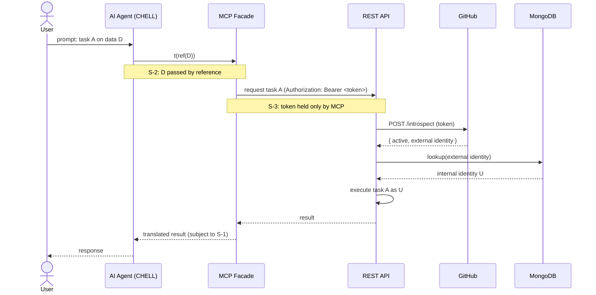
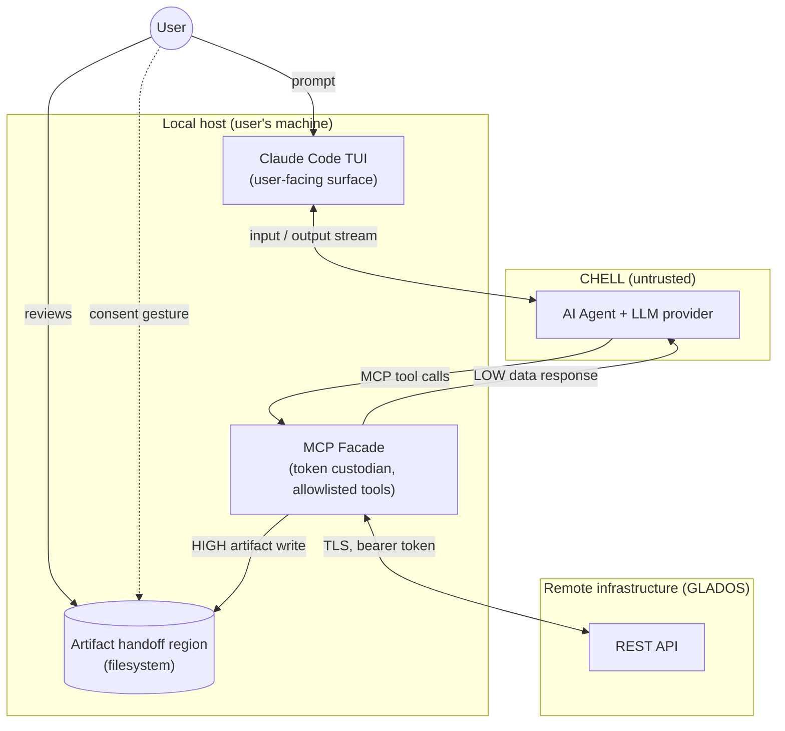

# Agentic Implementation Plan

## 1. Problem and Context
With the successful launch of the CLI, the next step is to make the GLaDOS platform compatible with Model Context Protocol (MCP) tool calls so that experiments can be carried out be autonomous Artificial General Inteligence (AGI) agents. Specifically, the goal is to give the user the ability to delegate actions they can take on the platform manually to an AI agent that performs them on their behalf.

After some consideration, the team decided that it is recommended to pursure a local MCP facade that calls to existing REST endpoints with authentication done via token introspection. For more details on this decision consult section 5 and 6 of this document. 

## 2. Scope and limitations
The following describes both the scope of the agentic implementation feature as well as possible limitations:

- The agentic model used by the user is not within scope; the mistakes the model might make in utilizing MCP tool calls or in adjusting the hyperparameters of an experiment for a new run is not within scope. Ergo, the infrastructure for such calls to occur securely and consistently is within scope; the quality of the model is not.
- The user of this feature is assumed to have a GitHub account for which a GitHub token can be gained through device flow authentication, which allows for authentication to GLADOS; Google OAuth or other provider specific Oauth routes are not within scope.
- We recommend limiting this feature to user's of priviledged or admin permission levels, however this feature does have the possibility to be open to users at all permission levels.
- All operations requires a verification step via GitHub api, users who hit their GitHub api limit of [5000 requests per hour](https://docs.github.com/en/rest/using-the-rest-api/rate-limits-for-the-rest-api?apiVersion=2026-03-10) will not be able to access MCP features and have to use the browser GUI manually

## 3. Invariants
Let `t` be an MCP tool call, and `ENDPOINT` be an authenticated call (using a stored `token` for the active session) to the existing REST API counterpart for `t`.

#### **3.1 Functional Invariant**
For all tool invocation with arguments `t(args)`, the following premises must hold:

**I-1 - Structural**. The invocation of `t(args)` causes exactly one ENDPOINT call to be reported to the caller. The MCP _MAY_ retry on transport failure up to a bounded number of times before surfacing failure; retries are not counted as separate logical calls.

**I-2 - Payload**. Content of `args` must not be modified beyond translation to comply with `ENDPOINT` argument schema. A translation here is defined as a syntactic transformation using a declared schema, no values should be transformed.

**I-3 - Response Content**. Given that the MCP tool call is going to translate the REST response into an MCP response, the MCP response carries no information not present in the REST response; fields may be dropped, but never fabricated, inferred, or sourced from outside the REST response.

#### **3.2 Security Invariant**
The LLM agent and its provider sit outside of GLADOS's trust boundary and are therefore modeled as a Compromisable Host or External LLM Liaison (CHELL). The following invariants must hold against the CHELL:

**S-1 - Result Confidentiality**. CHELL shall not gain read access to result data returned by any `ENDPOINT` call. MCP responses, error messages, transport metadata, and diagnostic output shall not carry result content to CHELL.

**S-2 - Artifact Confidentiality**. CHELL shall not gain read or write access to artifacts that a tool call requires or produces. Artifact content reaches CHELL only through channels the user explicitly drives (e.g., paste, upload).

**S-3 - Credential Confinement**. The `token` shall not be observable by CHELL through any MCP tool result, error path, argument echo, or diagnostic output.

**S-4 - Bounded Tool Surface**. CHELL may only invoke `t` drawn from a statically declared allowlist. No `t` shall accept free-form filesystem paths, URLs, shell expressions, or ENDPOINT specifiers as arguments. This prevents CHELL from inducing arbitrary reads, writes, or egress through args.

**S-5 - Diagnostic Discipline**. MCP facade logs, stderr, crash output, and telemetry shall not contain result data, artifact content, or credential material in any form CHELL or its host can read.

**S-6 - Egress Confinement**. The MCP facade shall initiate no outbound network connection other than to ENDPOINT over verified TLS. CHELL shall not be able to induce arbitrary egress through args.

**S-7 - User Override**. Voluntary delivery of data to CHELL by the user (paste, upload, screen sharing, dictation) lies outside the protection of `S-1 … S-6`. The facade shall neither facilitate, conceal, nor attempt to detect such transfers.

**S-8 - Audit Integrity**. No state-mutating tool call shall complete without a corresponding append-only audit record being durably written. Records shall be neither modifiable nor deletable through any system interface. The audit log shall contain no silent gaps: any period during which audit writes were unavailable shall itself be reflected in the log as a degraded-mode record.
## 4. Architecture Overview
Component diagrams and dataflow naratives. Add a subheader for each supporting subsystem

### 4.1 Authentication Subsystem
The system establishes caller identity at the REST API via RFC 7662 token introspection. The MCP facade is the sole custodian of the user's token within the local environment; this placement is what realizes `S-3` (credential confinement).
> No MCP tool surface can expose the token to CHELL, by construction.

#### Components
1. **AI agent (within CHELL).** Issues MCP tool calls. Never observes the token.
2. **MCP facade.** Holds the token, attaches it to REST calls, translates responses per `Section 3.1`, returns them to the agent subject to `Section 3.2`.
3. **REST API**. Validates the token via introspection, resolves identity, executes the requested operation under the resolved identity.
GitHub. Issues the token and serves the RFC 7662 introspection endpoint. Source of external identity.
4. **MongoDB.** Maps external (GitHub) identity to internal system identity U. Source of truth for per-user authorization.

### 4.2 Audit Logs

To appropriately log the actions of the agent, we recommend a two-pronged approach with an audit log both locally available for a user as well as a remote audit log for GLADOS's server. This ensures that the user can reread the local log to be aware of the actions of the agent, and developers can monitor agent activity via the remote log. 

#### **1. Remote Audit Log**
Creating a new collection on GLADOS’s MongoDB with role-based restrictions that prevent editing operations is our recommended implementation of a synchronous append-only sink. 

In this collection, record an agent request’s  `event_id, user_id, timestamp, action_type, action_result, and agent_id`. A successful write/insertion to the collection allows the request to go through (the action to occur on the server); otherwise, the request is denied. A health check, implemented by a ping command to the database via a Next.js endpoint on GLADOS’s server, checks if an insertion could happen to the collection; if the check returns unhealthy, allow agentic non-mutating requests (i.e. read operations) but return degraded-mode error on mutating requests.

#### **2. Local Audit Log**
For a more thorough record in order to examine what actions the agents took while utilizing their account, utilizing the Python logging module may be most effective and allow flexibility. The module allows to write to a user’s local file to implement more extensive logging beyond the CLI’s current printouts to the console. Record agentic actions, including `Datetime, Action taken, Approval from User, Result (Success or Failure), Stack Trace (If it Exists)`, to ensure that the dynamic information is included efficiently within a file that can then be scanned for certain keywords.

### 4.3 MCP Facade
The system follows a facade architecture: a local process on the user's machine sits between the agent (running under the Claude Code TUI, or any equivalent host) and the remote REST API. The facade is the only component that holds credentials, makes outbound REST calls, and decides what crosses the trust boundary to the agent. Data classified high-sensitivity does not flow to the agent through facade responses; instead, the facade places it in a handoff region on the local filesystem, and the user performs an explicit gesture to release it. The mechanism for that gesture is intentionally underspecified at this layer; suggested implementations are listed below.

#### **Components**

- **Claude Code TUI.** User's terminal interface to the agent. Treated as a trusted surface for input/display; does not enforce policy itself.
- **AI Agent + LLM provider.** The reasoning and tool-invocation loop. Modeled as CHELL — anything the agent observes is assumed to be observable by an adversary.
- **MCP Facade.** Local process. Holds the REST API credentials, exposes a static allowlist of tools, and decides per tool whether the result returns inline (low-sensitivity path) or via the handoff region (high-sensitivity path).
- **Artifact handoff region.** A filesystem location where the facade deposits high-sensitivity results. The release of content from this region to the agent is mediated entirely by the user.
REST API. Remote service; authenticates via token introspection, authorizes per-identity.

#### **Data paths**

- `LOW` - **Low-sensitivity path.** Agent → MCP tool call → REST → translated MCP response → agent. Constrained by S-1 (no high-sensitivity content in responses) and §3.1 (response translation).
- `HIGH` - **High-sensitivity path.** Agent → MCP tool call → REST → artifact written to handoff region. The agent receives only an acknowledgement; the result content sits at rest until the user acts.

#### **Consent gesture - suggested mechanisms**
The architecture does not mandate a specific gesture; future contributors should pick what fits their platform. Non-exhaustive options:

- **Copy / paste.** User pastes artifact content into the TUI. Unforgeable; manual.
- **Permission flip (chmod).** User grants the agent's runtime UID read access; an allowlisted tool then fetches. Requires UID separation between facade and agent.
- **Move into a watched inbox.** User drops the artifact into a designated directory the agent reads on demand. Same UID consideration as above.
Confirmation token. User reviews the artifact, types a short token displayed alongside it into the TUI; facade releases on next reference. Adds binding/expiry complexity.
- **Out-of-band CLI helper.** User runs a small command that pushes content into the agent's input stream. Useful where clipboard integration is poor.

These are not mutually exclusive, a system may offer several.

## 5. Implementation notes
Some useful implementation notes
### 5.1 Strive for enforcement through architecture and design rather than prompt engineering
An LLM at the end of the day is a probabilistic model. Because of that, banking on the fact that it output will be governable and deterministic is a naive assumption. If you wish for the agent to not attempt an action, then the architecture should never allow for such cases. For example, instead of prompting "Do not read the content of this secret file," you can instead design the system so that the agent can issue a directive to handle such files to an MCP server instead. Now, the agent concern is no longer "I must not touch this file" but rather "I interact with this server to carry out the function on my behalf", which is easier to enforce and control. 

## 6. Alternatives Considered
This section details alternative implementations that were considered during initial architecting and design of the agentic workflow integration.

### 6.1 MCP as an extention of the current `Next.js` REST API
Rather than running the MCP facade locally on the user's machine, MCP tool calls could be served directly from the existing Next.js REST API, with clients connecting over the network.

#### **Why not adopted**
The REST API authenticates callers by introspecting GitHub-issued tokens (Secion 6.2). In a co-hosted model, the MCP transport would need to deliver those tokens from client to backend. However, MCP's transport-level authorization, defined in the [MCP authorization](https://modelcontextprotocol.io/specification/2025-11-25/basic/authorization) specification, is OAuth-based and does not accommodate passing arbitrary upstream credentials. Adopting this alternative would require either re-implementing the backend's authentication layer to comply with the MCP authorization spec, or inventing a non-standard credential-passing mechanism that would break compatibility with conforming MCP clients. The current team judged the local-facade approach preferable, as it preserves the introspection-based auth model unchanged and reuses REST endpoints without modification.

#### **Conditions to reconsider**
This decision should be revisited if the system migrates authentication to a flow compatible with the MCP authorization spec, or if operating a per-user local facade becomes a deployment burden disproportionate to the cost of MCP-spec auth compliance.

### 6.2 Self-issued JWTs in place of GitHub token introspection
Rather than delegating authentication to GitHub and introspecting GitHub-issued tokens at the REST API (RFC 7662), the system could mint its own JWTs after a user authenticates via the web frontend. Clients (web, CLI, and MCP facade) would present these JWTs in REST calls; the REST API would verify them locally without a round trip to an external provider.

#### **Current state of the system**
The web frontend authenticates users via Auth.js against GitHub or Google. Auth.js manages session state for the browser flow; no JWT is minted or consumed anywhere in the system today. For the CLI (a browserless client that calls the REST API directly), authentication is delegated to GitHub via the OAuth device authorization flow (RFC 8628); the CLI then presents the resulting GitHub token to the REST API, which introspects it. The MCP facade is a browserless client of the same shape and inherits the same pattern.

#### **Why not adopted**
Introducing JWTs would require:

- A token issuance path on the REST API, including signing key management and rotation.
- A browserless acquisition flow, either user-driven copy/paste of a token minted in the web frontend, or a custom device-flow analogue against our own issuer.
- Token revocation and lifecycle handling at the API layer, since one of introspection's benefits (immediate revocation by the identity provider) would no longer come for free.

The current team judged this disproportionate to the value gained, particularly because:

- The CLI was built first under the same constraint; delegating browserless auth to GitHub's device flow solved the UX problem at zero implementation cost.
- The REST API already supports introspection, so the MCP facade reuses existing infrastructure without modification.
- Cross-client identity remains anchored at a single source (GitHub), removing the need for the system to maintain its own identity claims.

#### **Conditions to reconsider**
This decision should be revisited if any of the following becomes true:

- Introspection latency becomes a measurable bottleneck and caching proves insufficient.
- The system requires identity claims or scopes that GitHub does not carry.
- Dependency on GitHub's introspection endpoint availability becomes operationally unacceptable.
- A second-class identity provider (beyond GitHub and Google) is introduced and federation becomes preferable to per-provider token validation.

#### **Implementation Costs if reconsidered**
Future contributors taking this on should expect to implement token issuance, signing key rotation, a browserless token acquisition UX (the painful part), local JWT verification at REST, and a revocation strategy. None of this is intractable; the current team simply judged the present arrangement adequate for the system's needs.

## 7. Threat Modeling
This section enumerates threats within the system's scope using the STRIDE framework (Spoofing, Tampering, Repudiation, Information disclosure, Denial of service, Elevation of privilege). The aim is to document the attack surface so new contributors can reason about changes, and to make existing mitigations and known gaps legible. Threats outside the scope of the system (credentialed insiders, social engineering, supply-chain compromise of dependencies) are noted only where they meaningfully shape design decisions.

## 8. Testing strategy

To ensure that the features associated with enabling agentic workflows in GLADOS are properly implemented, creating a multi-faceted testing strategy is crucial. The following tests can establish correctness and also ensure implementation matches security specifications: 

### 8.1 Agent Testing to test End-to-end Operations and Monitor Nondeterministic Interactions 

This testing would verify that end-to-end operations of a local agent using the locally hosted MCP servers to call the REST API endpoints, be recorded in the audit log, and then return the expected payload. This would ensure that the correct sequency of calls could occur. 

This test would use the addnums experiment (located here: [Add Nums Experiment](https://github.com/AutomatingSciencePipeline/Monorepo/blob/main/example_experiments/python/addNums.py)) 

A 32 GB VM for running local models can be available at request from the CSSE Department system admin.  

Using Ollama to run models locally will enable effective model management- utilize a model with Ollama that uses approximately 8B-16B parameter size model in order to not use resources available via the VM effectively. 

### 8.2 Unit Testing of MCP Endpoints 

Create a test suite composed of unit tests that mock the Next.js REST endpoints to ensure that the MCP server calls in order to test conformation of the functional invariants defined in 3.1. 

To test the structural invariant, each MCP tool call should result in one HTTP request sent to the REST endpoint, with successful calls tested as well as calls that require retries before surfaced failure. 

To test the payload invariant, create unit tests with a variety of arguments to ensure that the corresponding REST requests has the proper schema with no incorrect changing of the values. 

To test the response invariant, mock custom payloads from the REST API to ensure that the MCP server does not create, add, or remove fabricated data in the responses.
 

## 9. Unresolved decisions

## 10. References

- [Utilizing Ollama](https://www.mindstudio.ai/blog/ollama-run-ai-models-locally-claude-code-workflows)
- [RFC7662](https://www.rfc-editor.org/rfc/rfc7662)
- [RFC8628](https://www.rfc-editor.org/rfc/rfc8628)
- [MCP Specification](https://modelcontextprotocol.io/specification/2025-11-25)
- [Github API Request Limit](https://docs.github.com/en/rest/using-the-rest-api/rate-limits-for-the-rest-api?apiVersion=2026-03-10)

